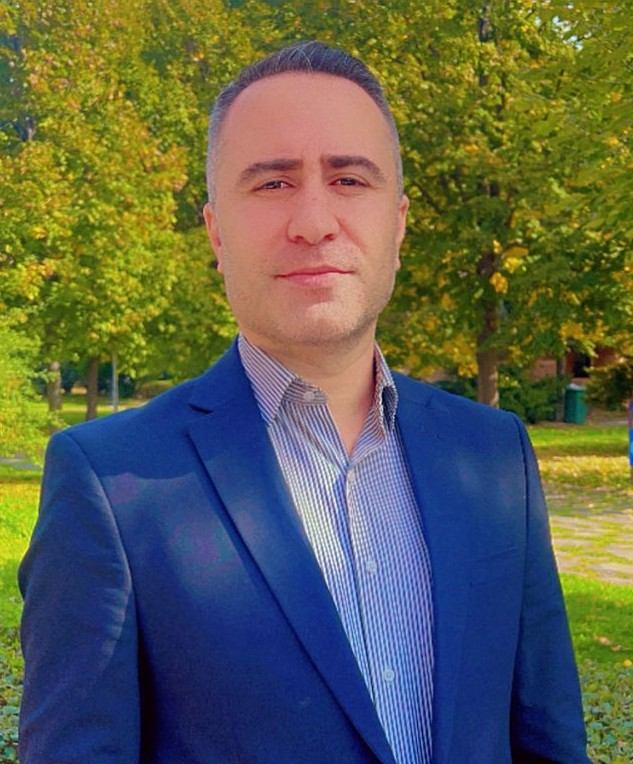

<table>
<tr>
  <td width="200" valign="top" align="center" style="padding-top:18px;">
    
      
    <b>Research Scientist</b> 
    
      
    <a href="mailto:jehad_cheyi@yahoo.com" style="color:#8B5C9E;">Email</a> &nbsp;·&nbsp;
    <a href="https://www.linkedin.com/in/YOUR-LINK" style="color:#8B5C9E;">LinkedIn</a> &nbsp;·&nbsp;
    <a href="https://twitter.com/YOUR-HANDLE" style="color:#8B5C9E;">Twitter</a>
      
    
      <b>Technical Skills:</b> Python, SQL, AWS, Snowflake, MATLAB
    
  </td>
  <td valign="top" style="padding-left:36px;">

<h1 style="margin-bottom:0.1em; color:#8B5C9E; font-family:Georgia,serif; font-weight:normal;">Jehad Cheyi</h1>
<i>Research Scientist & Data Scientist</i>
  

<!-- About -->

I am a research scientist and data scientist with a Ph.D. in Physics from The University of Texas at Dallas. My interests span data-driven discovery, machine learning, and translating analytics into real-world impact. I am committed to collaborative, interdisciplinary research and teaching.

---

### Academic Appointments

- <b>Data Scientist</b>, Toyota Financial Services (2022 – Present)  
  Production data integrity, predictive modeling, and business optimization.
- <b>Consultant, Data Science</b>, Shawhin Talebi Ventures LLC (2020 – Present)  
  Biometrics, machine learning for health and performance analytics.

---

### Education

| Degree  | Field   | Institution                         | Year   |
|---------|---------|-------------------------------------|--------|
| Ph.D.   | Physics | The University of Texas at Dallas   | 2022   |
| M.S.    | Physics | The University of Texas at Dallas   | 2019   |
| B.S.    | Physics | The University of Texas at Dallas   | 2017   |

---

### Selected Publications

- <b>Talebi S., Lary D.J., Wijeratne L. OH., & Lary, T.</b>  
  Modeling Autonomic Pupillary Responses from External Stimuli Using Machine Learning (2019).  
  <a href="https://doi.org/10.26717/BJSTR.2019.20.003446" style="color:#8B5C9E;">DOI: 10.26717/BJSTR.2019.20.003446</a>

- <b>Data-Driven EEG Band Discovery with Decision Trees</b>  
  <a href="https://www.mdpi.com/1424-8220/22/8/3048" style="color:#8B5C9E;">Sensors 2022</a>

- <b>Decoding Physical and Cognitive Impacts of Particulate Matter</b>  
  <a href="https://www.mdpi.com/1424-8220/22/11/4240" style="color:#8B5C9E;">Sensors 2022</a>

---

### Projects

**EEG Band Discovery with Decision Trees**  
Developed a data-driven strategy for discovering optimal EEG bands using Python and spectral analysis.  

**Particulate Matter & Biometrics**  
Trained 100+ ML models (MATLAB) to estimate particulate matter concentrations from biometric data.  

---

### Teaching & Outreach

- Causality: The New Science of an Old Question (GSP Seminar, 2021)
- Guest Lectures: Dimensionality Reduction, Fourier and Wavelet Transforms, Optimization
- [Data Science YouTube Channel](https://www.youtube.com/channel/UCa9gErQ9AE5jT2DZLjXBIdA)

  </td>
</tr>
</table>
